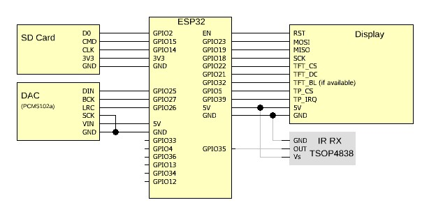

# ESP32-MiniWebRadio V2

MiniWebRadio Features:
<ul>
<li>User interfaces: TFT touchscreen display, web browser and FTP</li>
<li>Functions: WiFi Radio, Digital Clock, MP3 player, Alarm, Sleep timer, adjust screen brightness, EQ settings and Volume, web browser User Interface, access SD card via FTP (e.g. FileZilla), IR remote controller support</li>
<li>Up to 999 pre-set stations can be held in stations.csv file on SD card (can edit using web UI)</li>
<li>Each station can display its own station icon (when saved to SD card)</li>
<li>Time is obtained via Network Time Protocol (NTP) from internet. Local Time Zone can be set from web UI</li>
<li>Web UI - MiniWebRadio can be accessed via any web browser (e.g. IE/Edge/Chrome/FireFox)</li>
<li>Internal SD card can be accessed via FTP (e.g. FileZilla)</li>
<li>Your home WiFi router SSID and password can be set using the browser on your smart phone (only required on first boot) or edit the networks.csv file on SD card</li>
<li>Play audio files on SD card or on DLNA home network (via web UI)</li>
<li>Use Infra-Red (IR) remote controller (38kHz NEC-encoded - e.g. arduino or mp3 remote). The web UI allows you to configure the buttons if required</li>
<li>One Alarm time can be pre-set using display (choose days, Monday-Sunday)</li>
<li>A Sleep timer can be set using display (switches off sound and screen after a pre-set time - max. 6 hours)</li>
<li>Can announce the time each hour when in radio mode (set via web UI)</li>
<li>Screen brightness can be adjusted using display (if the display has a backlight-pin)</li>
<li>Supports the Latin, Greek and Cyrillic character sets</li>
<li><a href="https://www.radio-browser.info/">Community Radio Browser</a> is integrated as a search engine. User can find new stations and then add them to the station list via web UI (with station icon if available) and then save the list and station icon file to the SD card</li>
<li>Channel lists can be exported or imported in Excel format (for data backup).</li>
</ul> 
Required HW:
<ul>
<li>ESP32 or ESP32-S3 board with PSRAM</li><li>Decoder module VS1053 or external DAC (e.g. PCM5102a)</li>
<li>TFT Display with Touchpad (SPI), Display controller can be ILI9341 (320x240px), HX8347D (320x240px), ILI9486 (480x320px), ILI9488 (480x320px) or ST7796 (480x320px)</li>
<li>SD Card (FAT32) + SD adapter (can use SD slot on back of TFT display if available)</li>
<li>IR receiver + IR remote controller (optional)
<li>Note: if using a VS1053, VS1053_SCK may need a 1k resistor connected to ground in order to boot</li>
</ul> 

Control is via the display touchscreen or a web page in a browser, no additional components such as switches, rotary encoders, capacitors or resistors are required.

Schematic with VS1053 
 

Schematic with external DAC 
 
 
<a href="https://github.com/schreibfaul1/ESP32-MiniWebRadio/blob/master/additional_info/MiniWebRadio%20V2%20Layout.pdf">Display (Layout)</a>

<a href="https://github.com/schreibfaul1/ESP32-MiniWebRadio/blob/master/additional_info/How%20to%20install.pdf">How to install:</a>
PlatformIO is definitely recommended as the IDE.

#### New in V2:

- The audioprocess works in its own task and is decoupled. If a VS1053 is used, it must have its own SPI bus (VS1053 uses HSPI - TFT uses VSPI). This prevents dropouts when drawing on the display or when the website is loading.
- The SD card is wired as SD_MMC to improve stability and increase speed. This means that the GPIOs cannot be chosen freely. The <a href="https://github.com/schreibfaul1/ESP32-MiniWebRadio/blob/master/additional_info/SD_Card_Adapter_for_SD_MMC_.jpg">SD card adapter</a> must not have any resistors as pull-ups or in series. For best display update speed, use 40MHz frequency for SD card if possible (SDMMC_FREQUENCY 40000000 in common.h).
- Audio can be decoded using software and a DAC instead of VS1053 decoder board. Possible formats are mp3, aac, mp4 and flac (flac requires PSRAM). DAC (e.g. UDA13348, MAX98357A, PCM5102A) is connected via I2S. AC101, ES8388 and WM8978 (TTGO audioT board) audio decoder boards are also supported
- 480x320px display supported. The ILI9486 (SPI display from the Raspberry PI) is also supported
- The SD card files can be accessed via FTP. See settings for <a href="https://github.com/schreibfaul1/ESP32-MiniWebRadio/blob/master/additional_info/Filezilla.pdf">Filezilla</a>. The username and password are 'esp32' (this can be changed in 'common.h')
- Access Point SSID/password can be set using mobile phone browser - no need to modify source code or networks.csv file on SD card
- Stations URLs support entry of username and password if the server expects access data, "URL|user|pwd"
- Can process local playlists in m3u format
- Either the ESP32 or the ESP32-S3 can be used (PSRAM is highly recommended)
- IR remote button codes can be changed by user using web UI
- Improved web UI reliability
- VU meter added to display
- Timezone can be set using web UI
- Play media files on home network DLNA (uPNP/DLNA app on smart phone, router, etc.)
- Prevent clicks when changing radio stations

 

Codec\Decoder| VS1053B        | PCM5102A, AC101, ES8388, WM8978 |
|----------|----------|----------|
| mp3 | y| y |
| aac | y | y |
| aacp (HLS) | y  | mono |
| wav | y | y  |
| flac | with plugin | blocksize max 8192 bytes |
| vorbis | y  | y (<=196Kbit/s)  |
| m4a | y  | y |
| opus | n  | y (celt)  |

 
 

